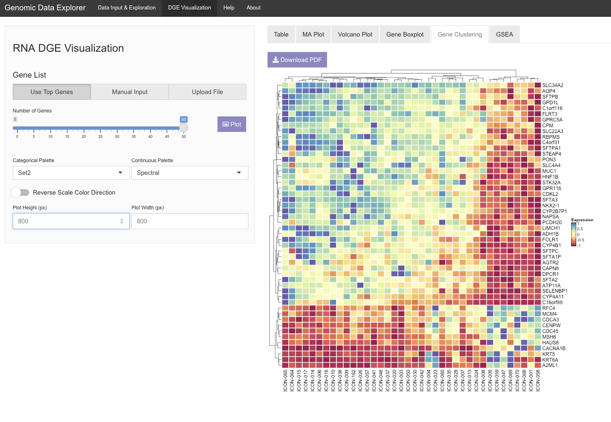
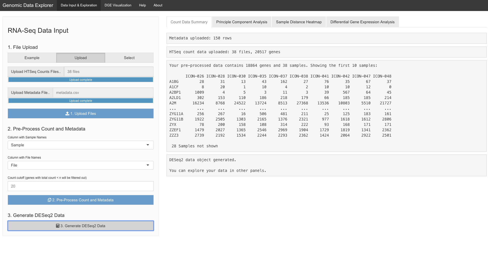

# GDE_RNA - R Shiny Visualization App for RNA-seq Data






This repository hosts the code for the RNA-seq visualization project at The University of Texas MD Anderson Cancer Center.
The guide includes two parts:

1. **Instructions for Developers**
2. **Instructions for Users**

---

## Instructions for Developers

### 1. Overview

You can clone this repository to your local computer and make further developments on top of these files.
The application depends on several R Bionconductor packages and another R package specifically written
for bulk RNA-seq visualization [`xmcutil`](https://github.com/xmc811/xmcutil).

### 2. Containerization

The roadmap of the containerization process can be summarized as below:

> 
> --- Start --- `rocker/shiny-verse:latest` (Publicly available image; Community-maintained)
> 
> -- Step 1 --> `rocker_gde_base:latest` (Intermediate image) 
>
> -- Step 2 --> `rocker_gde_rna:latest` (Final image)
> 

It starts from the publicly available image [`rocker/shiny-verse:latest`](https://hub.docker.com/r/rocker/shiny-verse), upon which the intermediate Docker image `rocker_gde_base:latest` can be built (Step 1). The purpose of the Step 1 is to install those dependencies not frequently updated, thus facilitating the CI/CD process. The Step 2 is to build the final Docker image `rocker_gde_rna:latest` from the intermediate image `rocker_gde_base:latest`.
Hence, during each development cycle, if changes are limited to the R Shiny App (instead of the underlying dependencies), only the Step 2 is necessary; Otherwise, both steps are required.

The Step 1 can be achieved by:

```
# From the root directory of the cloned repository
cd Rocker_GDE_base
docker build -t rocker_gde_base:latest .
```

The Step 2 can be achieved by:

```
docker build -t rocker_gde_rna .
```

After building the final image. The commands to run the image and access the app can be found below (See Instructions for Users - To Run the Application Locally Using Docker).

Note: the Step 1 may take a long time (>10 min) to finish. It is recommended to further split the process into multiple steps to increase the number of "layers" of the containerization, thus improving the development efficiency.

### 3. Placeholders

There are some placeholders in the app for further developments. These will be described in details in the Section Instructions for Users.

---

## Instructions for Users

### 1. To Run the Application Locally Using Docker

It is recommended to use Docker Engine to run the R Shiny application package `rocker_gde_rna:1.0`:

```
docker pull ghcr.io/xmc811/rocker_gde_rna:1.0
docker run --rm -p 3838:3838 ghcr.io/xmc811/rocker_gde_rna:1.0
```

You should be able to access the application at `localhost:3838`.

You may also clone the repository and run it within RStudio. However, it requires installation of additional R packages including [`xmcutil`](https://github.com/xmc811/xmcutil). See the Section **Instructions for Developers** for further details.

---

### 2. User Interface

As shown in the figure below, there are four top navigation tabs. The first two tabs contain core functionalities of the app, while the last two are merely placeholders serving as templates for further development.

- Data Input & Exploration - includes data uploading, summary, sample-level data exploration, and differential gene expression (DGE) analysis.
- DGE Visualization - visualizes the DGE results, including MA plots, volcano plots, boxplots, sample-gene heatmaps, and Gene-Set Enrichment Analysis (GSEA).
- Help - a placeholder tab for embedding the `.pdf` help file.
- About - a placeholder tab for showing addtional information.


---

### 3. File Upload

The file upload section contains three options. By default, the option "Example" is selected.

- Example - sample RNA-Seq data with 10 samples.
- Upload - users can upload HTSeq-count output files, with one file per sample.
- Select - a placeholder for further development. (e.g.: a dedicated storage folder can be configured to allow users to select files/data if the app is hosted on a server).

